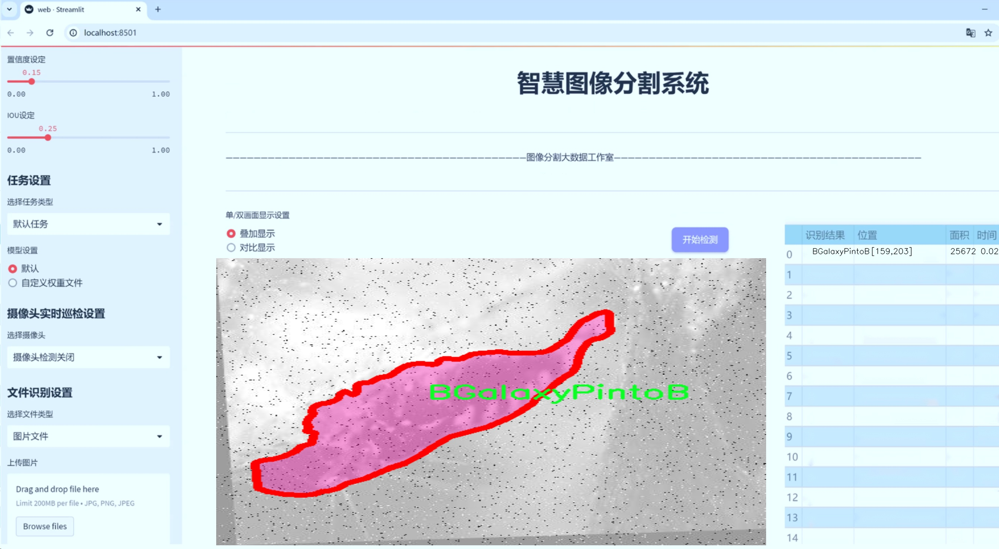
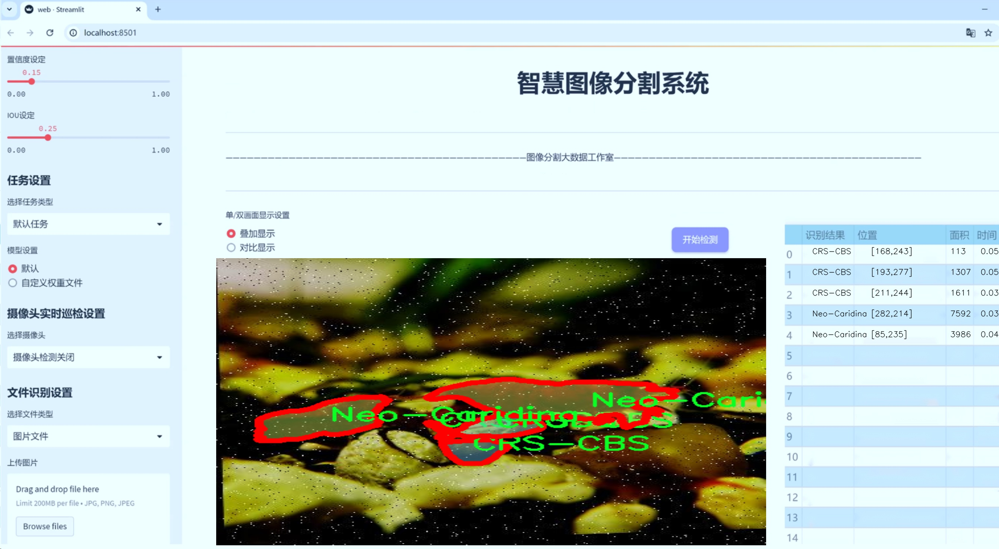
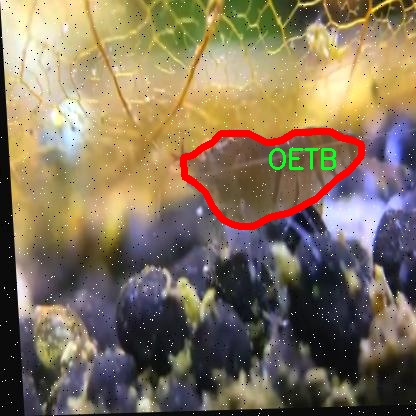
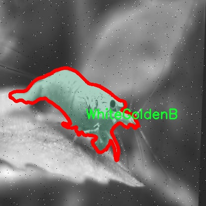
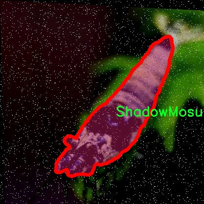
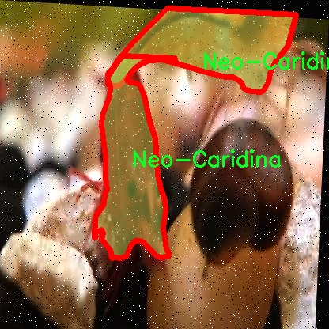
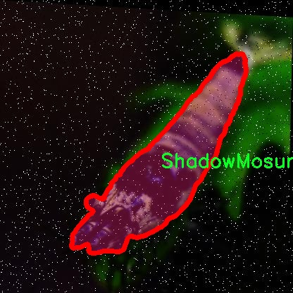

# 矮虾类型分类图像分割系统源码＆数据集分享
 [yolov8-seg-CSwinTransformer＆yolov8-seg-C2f-EMSCP等50+全套改进创新点发刊_一键训练教程_Web前端展示]

### 1.研究背景与意义

项目参考[ILSVRC ImageNet Large Scale Visual Recognition Challenge](https://gitee.com/YOLOv8_YOLOv11_Segmentation_Studio/projects)

项目来源[AAAI Global Al lnnovation Contest](https://kdocs.cn/l/cszuIiCKVNis)

研究背景与意义

近年来，随着水产养殖业的快速发展，矮虾作为一种受欢迎的观赏水生生物，其市场需求不断增加。矮虾的多样性和色彩丰富性使其在全球范围内受到广泛关注，尤其是在水族爱好者和商业养殖者中。然而，矮虾的种类繁多，且在形态和颜色上存在显著差异，这给其分类和管理带来了挑战。传统的人工分类方法不仅耗时耗力，而且容易受到主观因素的影响，导致分类结果的不准确。因此，开发一种高效、准确的自动化分类系统显得尤为重要。

在这一背景下，计算机视觉技术的迅猛发展为矮虾的自动分类提供了新的解决方案。尤其是基于深度学习的目标检测和图像分割技术，已经在多个领域取得了显著的成果。YOLO（You Only Look Once）系列模型因其高效的实时检测能力和良好的分类精度，成为了目标检测领域的热门选择。YOLOv8作为该系列的最新版本，进一步提升了模型的性能，具备了更强的特征提取能力和更快的推理速度，适合处理复杂的图像分类任务。

本研究旨在基于改进的YOLOv8模型，构建一个针对矮虾类型的分类图像分割系统。我们将利用"Dwarf-Shrimp Detection Dataset"这一数据集，该数据集包含12000张图像，涵盖25种不同的矮虾类别。通过对这些图像进行实例分割，我们不仅能够实现对矮虾的精准定位，还能有效区分不同种类的矮虾。这一系统的开发将为矮虾的自动分类提供强有力的技术支持，极大地提高分类效率和准确性。

此外，本研究的意义还在于推动水产养殖领域的智能化发展。通过引入先进的计算机视觉技术，我们可以为养殖者提供更为科学的管理工具，帮助他们在繁殖、选种和市场营销等方面做出更为精准的决策。同时，该系统的成功应用还可以为其他水生生物的分类与管理提供借鉴，推动相关领域的研究进展。

总之，基于改进YOLOv8的矮虾类型分类图像分割系统的研究，不仅具有重要的学术价值，还有助于提升水产养殖的管理水平，促进相关产业的可持续发展。通过本研究，我们期望能够为矮虾的保护与繁育提供新的思路和方法，为水族爱好者和养殖者带来更好的服务体验。

### 2.图片演示






##### 注意：由于此博客编辑较早，上面“2.图片演示”和“3.视频演示”展示的系统图片或者视频可能为老版本，新版本在老版本的基础上升级如下：（实际效果以升级的新版本为准）

  （1）适配了YOLOV8的“目标检测”模型和“实例分割”模型，通过加载相应的权重（.pt）文件即可自适应加载模型。

  （2）支持“图片识别”、“视频识别”、“摄像头实时识别”三种识别模式。

  （3）支持“图片识别”、“视频识别”、“摄像头实时识别”三种识别结果保存导出，解决手动导出（容易卡顿出现爆内存）存在的问题，识别完自动保存结果并导出到tempDir中。

  （4）支持Web前端系统中的标题、背景图等自定义修改，后面提供修改教程。

  另外本项目提供训练的数据集和训练教程,暂不提供权重文件（best.pt）,需要您按照教程进行训练后实现图片演示和Web前端界面演示的效果。

### 3.视频演示

[3.1 视频演示](https://www.bilibili.com/video/BV1Gu2hYwE1r/)

### 4.数据集信息展示

##### 4.1 本项目数据集详细数据（类别数＆类别名）

nc: 13
names: ['BGalaxyPintoB', 'BlueBolt', 'CRS-CBS', 'FancyTigerB', 'KingKongB', 'Neo-Caridina', 'OETB', 'PandaB', 'RGalaxyPintoB', 'RacoonTigerB', 'ShadowMosura', 'TangerineTigerB', 'WhiteGoldenB']


##### 4.2 本项目数据集信息介绍

数据集信息展示

在进行矮虾类型分类图像分割系统的研究与开发过程中，"Dwarf-Shrimp Detection Dataset"作为核心数据集，发挥了至关重要的作用。该数据集专门为改进YOLOv8-seg模型而设计，旨在提升矮虾的检测与分类精度。数据集包含13个不同的类别，每个类别代表一种独特的矮虾品种，具体包括：BGalaxyPintoB、BlueBolt、CRS-CBS、FancyTigerB、KingKongB、Neo-Caridina、OETB、PandaB、RGalaxyPintoB、RacoonTigerB、ShadowMosura、TangerineTigerB和WhiteGoldenB。这些类别不仅涵盖了市场上常见的矮虾品种，还包括一些较为稀有和独特的变种，充分反映了矮虾的多样性和丰富性。

数据集的构建过程经过精心设计，确保了样本的多样性和代表性。每个类别的图像均经过严格筛选，确保其在光照、背景、角度等方面的多样性，以便模型能够在各种环境下进行有效的学习和泛化。图像的分辨率和质量也经过优化，以确保在训练过程中，模型能够捕捉到矮虾的细微特征，从而提高分类的准确性。

在数据集的标注过程中，采用了高精度的图像分割技术，对每个矮虾样本进行了细致的标注。这种标注不仅包括矮虾的轮廓，还涵盖了其颜色、纹理等特征信息，使得模型在训练时能够充分理解不同品种之间的细微差别。这种精细化的标注方式为后续的模型训练提供了坚实的基础，确保了模型在实际应用中的可靠性和有效性。

此外，数据集还考虑到了不同用户的需求，提供了多种数据格式供研究人员和开发者使用。无论是需要进行深度学习训练的原始图像，还是经过处理的标注数据，用户都可以根据自己的需求进行选择。这种灵活性不仅提高了数据集的可用性，也促进了相关研究的开展。

通过对"Dwarf-Shrimp Detection Dataset"的深入分析与应用，研究人员能够更好地理解矮虾的分类特征，并在此基础上优化YOLOv8-seg模型的性能。该数据集的发布，不仅为矮虾分类研究提供了宝贵的资源，也为相关领域的研究者提供了一个良好的实验平台。未来，随着数据集的不断扩展和更新，预计将会有更多的矮虾品种被纳入研究范围，从而推动该领域的进一步发展。

总之，"Dwarf-Shrimp Detection Dataset"作为一个高质量的图像分割数据集，凭借其丰富的类别、多样的样本和精细的标注，为矮虾类型分类的研究提供了坚实的基础。随着深度学习技术的不断进步，该数据集将继续发挥其重要作用，助力于矮虾分类及相关研究的深入开展。











### 5.全套项目环境部署视频教程（零基础手把手教学）

[5.1 环境部署教程链接（零基础手把手教学）](https://www.bilibili.com/video/BV1jG4Ve4E9t/?vd_source=bc9aec86d164b67a7004b996143742dc)


[5.2 安装Python虚拟环境创建和依赖库安装视频教程链接（零基础手把手教学）](https://www.bilibili.com/video/BV1nA4VeYEze/?vd_source=bc9aec86d164b67a7004b996143742dc)

### 6.手把手YOLOV8-seg训练视频教程（零基础小白有手就能学会）

[6.1 手把手YOLOV8-seg训练视频教程（零基础小白有手就能学会）](https://www.bilibili.com/video/BV1cA4VeYETe/?vd_source=bc9aec86d164b67a7004b996143742dc)


按照上面的训练视频教程链接加载项目提供的数据集，运行train.py即可开始训练



     Epoch   gpu_mem       box       obj       cls    labels  img_size
     1/200     0G   0.01576   0.01955  0.007536        22      1280: 100%|██████████| 849/849 [14:42<00:00,  1.04s/it]
               Class     Images     Labels          P          R     mAP@.5 mAP@.5:.95: 100%|██████████| 213/213 [01:14<00:00,  2.87it/s]
                 all       3395      17314      0.994      0.957      0.0957      0.0843

     Epoch   gpu_mem       box       obj       cls    labels  img_size
     2/200     0G   0.01578   0.01923  0.007006        22      1280: 100%|██████████| 849/849 [14:44<00:00,  1.04s/it]
               Class     Images     Labels          P          R     mAP@.5 mAP@.5:.95: 100%|██████████| 213/213 [01:12<00:00,  2.95it/s]
                 all       3395      17314      0.996      0.956      0.0957      0.0845

     Epoch   gpu_mem       box       obj       cls    labels  img_size
     3/200     0G   0.01561    0.0191  0.006895        27      1280: 100%|██████████| 849/849 [10:56<00:00,  1.29it/s]
               Class     Images     Labels          P          R     mAP@.5 mAP@.5:.95: 100%|███████   | 187/213 [00:52<00:00,  4.04it/s]
                 all       3395      17314      0.996      0.957      0.0957      0.0845


### 7.50+种全套YOLOV8-seg创新点代码加载调参视频教程（一键加载写好的改进模型的配置文件）

[7.1 50+种全套YOLOV8-seg创新点代码加载调参视频教程（一键加载写好的改进模型的配置文件）](https://www.bilibili.com/video/BV1Hw4VePEXv/?vd_source=bc9aec86d164b67a7004b996143742dc)

### 8.YOLOV8-seg图像分割算法原理

原始YOLOv8-seg算法原理

YOLOv8-seg算法作为目标检测领域的一项重要进展，继承并发展了YOLO系列算法的优良传统，结合了多项创新技术，使其在精度和效率上都达到了新的高度。该算法的架构由输入层、主干网络、特征融合层和解耦头组成，整体设计旨在提升目标检测的准确性和速度。YOLOv8-seg在YOLOv5和YOLOv7的基础上进行了优化，特别是在特征提取和损失函数的设计上，展现出更为卓越的性能。

在主干网络部分，YOLOv8-seg依然采用了CSPDarknet的设计理念，但将YOLOv5中的C3模块替换为C2f模块。C2f模块的引入，不仅实现了模型的轻量化，还在保持检测精度的同时，增强了特征的表达能力。C2f模块的设计灵感来源于ELAN结构，通过增加多个shortcut连接，显著缓解了深层网络中的梯度消失问题，促进了特征的重用。具体而言，C2f模块由多个CBS（卷积+归一化+SiLU激活）模块和若干个Bottleneck组成，允许在不同的分支中进行特征的并行处理与融合，从而提升了网络对复杂特征的学习能力。

特征融合层采用了PAN-FPN结构，进一步增强了多尺度特征的融合能力。YOLOv8-seg通过自下而上的特征融合策略，将高层特征与中层、浅层特征进行深度整合，确保了不同尺度的特征信息能够有效地传递。具体来说，YOLOv8-seg在上采样阶段直接将高层特征与中层特征进行拼接，形成更为丰富的特征图，这种特征融合方式不仅提升了模型对小目标的检测能力，还有效地保留了图像的细节信息。

YOLOv8-seg在目标检测的方式上进行了根本性的变革，抛弃了传统的Anchor-Base策略，转而采用Anchor-Free的思想。这一转变使得模型在处理目标时更加灵活，能够自适应地学习目标的特征，减少了对预定义锚框的依赖。此外，YOLOv8-seg在样本匹配策略上也进行了创新，采用了Task-Aligned的Assigner匹配方式，这种动态匹配机制能够更好地适应不同目标的特征，提高了模型的检测精度。

在损失函数的设计上，YOLOv8-seg引入了VFLLoss作为分类损失，并结合DFLLoss和CIoULoss用于边界框的回归。这种损失函数的组合不仅提高了分类的准确性，还有效地解决了目标检测中常见的样本不平衡问题。通过对难以分类的样本给予更高的权重，YOLOv8-seg能够在训练过程中更好地关注小目标和难以识别的对象，从而提升整体的检测性能。

数据预处理方面，YOLOv8-seg采用了YOLOv5的策略，包括马赛克增强、混合增强、空间扰动和颜色扰动等多种数据增强手段。这些增强方法的引入，使得模型在训练过程中能够接触到更多样化的样本，从而提高了模型的泛化能力和鲁棒性。

YOLOv8-seg的头部结构采用了解耦设计，结合了YOLOX和YOLOv6的解耦头部分，取消了objectness分支，通过边框回归和目标分类的两部分进行输出。这种设计使得模型在处理目标时，能够更加高效地进行分类和回归，减少了计算资源的消耗。

综上所述，YOLOv8-seg算法通过对主干网络、特征融合、样本匹配、损失函数及数据预处理等多个方面的优化，展现出了在目标检测任务中的强大能力。其轻量化的设计理念和高效的特征提取策略，使得YOLOv8-seg在处理复杂场景和小目标时，能够实现更高的准确率和更快的推理速度。这些创新不仅推动了YOLO系列算法的发展，也为目标检测领域的研究提供了新的思路和方向。


### 9.系统功能展示（检测对象为举例，实际内容以本项目数据集为准）

图9.1.系统支持检测结果表格显示

  图9.2.系统支持置信度和IOU阈值手动调节

  图9.3.系统支持自定义加载权重文件best.pt(需要你通过步骤5中训练获得)

  图9.4.系统支持摄像头实时识别

  图9.5.系统支持图片识别

  图9.6.系统支持视频识别

  图9.7.系统支持识别结果文件自动保存

  图9.8.系统支持Excel导出检测结果数据


### 10.50+种全套YOLOV8-seg创新点原理讲解（非科班也可以轻松写刊发刊，V11版本正在科研待更新）

#### 10.1 由于篇幅限制，每个创新点的具体原理讲解就不一一展开，具体见下列网址中的创新点对应子项目的技术原理博客网址【Blog】：


[10.1 50+种全套YOLOV8-seg创新点原理讲解链接](https://gitee.com/qunmasj/good)

#### 10.2 部分改进模块原理讲解(完整的改进原理见上图和技术博客链接)【如果此小节的图加载失败可以通过CSDN或者Github搜索该博客的标题访问原始博客，原始博客图片显示正常】

### YOLOv8简介
#### YOLOv8是什么？
YOLOv8是Ultralytics公司推出的基于对象检测模型的YOLO最新系列，它能够提供截至目前最先进的对象检测性能。

借助于以前的YOLO模型版本支持技术，YOLOv8模型运行得更快、更准确，同时为执行任务的训练模型提供了统一的框架，这包括：

目标检测
实例分割
图像分类
在撰写本文时，Ultralytics的YOLOv8存储库中其实还有很多功能有待添加，这包括训练模型的整套导出功能等。此外，Ultralytics将计划在Arxiv上发布一篇相关的论文，将对YOLOv8与其他最先进的视觉模型进行比较。

#### YOLOv8的新功能
Ultralytics为YOLO模型发布了一个全新的存储库（https://github.com/ultralytics/ultralytics）。该存储库被构建为用于训练对象检测、实例分割和图像分类模型的统一框架。

以下列举的是这个新版本的一些关键功能：

用户友好的API（命令行+Python）。
更快、更准确。
支持：
目标检测，
实例分割和
图像分类。
可扩展到所有以前的版本。
新的骨干网络。
新的Anchor-Free head对象检测算法。
新的损失函数。
此外，YOLOv8也非常高效和灵活，它可以支持多种导出格式，而且该模型可以在CPU和GPU上运行。

#### YOLOv8中提供的子模型


YOLOv8模型的每个类别中共有五个模型，以便共同完成检测、分割和分类任务。其中，YOLOv8 Nano是最快和最小的模型，而YOLOv8Extra Large（YOLOv8x）是其中最准确但最慢的模型。

YOLOv8这次发行中共附带了以下预训练模型：

在图像分辨率为640的COCO检测数据集上训练的对象检测检查点。
在图像分辨率为640的COCO分割数据集上训练的实例分割检查点。
在图像分辨率为224的ImageNet数据集上预处理的图像分类模型。
### 高效网络架构 CloAtt简介
众所周知，自从 ViTs 提出后，Transformer 基本横扫各大 CV 主流任务，包括视觉识别、目标检测和语义分割等。然而，一个比较棘手的问题就是这个架构参数量和计算量太大，所以一直被广受诟病。因此，后续有不少工作都是朝着这个方向去改进，例如 Swin-Transformer 在局部非重叠窗口中进行注意力计算，而 PVT 中则是使用平均池化来合并 token 以进一步压缩耗时。然而，这些 ViTs 由于其参数量太大以及高 FLOPs 并不适合部署到移动设备。如果我们直接缩小到适合移动设备的尺寸时，它们的性能又会显著降低。


#### MobileViT
因此，出现了不少工作聚焦于探索轻量级的视觉变换器，使 ViTs 适用于移动设备，CVHub 此前也介绍过不少的工作，大家有兴趣可以翻阅历史文章读读。例如，苹果团队提出的 MobileViT 研究了如何将 CNN 与 Transformer 相结合，而另一个工作 MobileFormer 则将轻量级的 MobileNet 与 Transformer 进行融合。此外，最新提出的 EdgeViT 提出了一个局部-全局-局部模块来聚合信息。以上工作的目标都是设计具有高性能、较少参数和低 FLOPs 的移动端友好型模型。


#### EdgeViT
然而，作者从频域编码的角度认为，在现有的轻量级模型中，大多数方法只关注设计稀疏注意力，以有效地处理低频全局信息，而使用相对简单的方法处理高频局部信息。具体而言，大多数模型如 EdgeViT 和 MobileViT，只是简单使用原始卷积提取局部表示，这些方法仅使用卷积中的全局共享权重处理高频本地信息。其他方法，如 LVT ，则是首先将标记展开到窗口中，然后使用窗口内的注意力获得高频信息。这些方法仅使用特定于每个 Token 的上下文感知权重进行局部感知。


#### LVT
虽然上述轻量级模型在多个数据集上取得了良好的结果，但没有一种方法尝试设计更有效的方法，即利用共享和上下文感知权重的优势来处理高频局部信息。基于共享权重的方法，如传统的卷积神经网络，具有平移等变性的特征。与它们不同，基于上下文感知权重的方法，如 LVT 和 NAT，具有可以随输入内容变化的权重。这两种类型的权重在局部感知中都有自己的优势。
#### NAT


受该博客的启发，本文设计了一种轻量级视觉变换器——CloAtt，其利用了上下文感知的局部增强。特别地，CloAtt 采用了双分支设计结构。
#### 局部分支
在局部分支中，本文引入了一个精心设计的 AttnConv，一种简单而有效的卷积操作符，它采用了注意力机制的风格。所提出的 AttnConv 有效地融合了共享权重和上下文感知权重，以聚合高频的局部信息。具体地，AttnConv 首先使用深度卷积（DWconv）提取局部表示，其中 DWconv 具有共享权重。然后，其使用上下文感知权重来增强局部特征。与 Non-Local 等生成上下文感知权重的方法不同，AttnConv 使用门控机制生成上下文感知权重，引入了比常用的注意力机制更强的非线性。此外，AttnConv 将卷积算子应用于 Query 和 Key 以聚合局部信息，然后计算 Q 和 K 的哈达玛积，并对结果进行一系列线性或非线性变换，生成范围在 [-1,1] 之间的上下文感知权重。值得注意的是，AttnConv 继承了卷积的平移等变性，因为它的所有操作都基于卷积。
#### 全局分支
在全局分支中则使用了传统的注意力机制，但对 K 和 V 进行了下采样以减少计算量，从而捕捉低频全局信息。最后，CloFormer 通过简单的方法将局部分支和全局分支的输出进行融合，从而使模型能够同时捕捉高频和低频信息。总的来说，CloFormer 的设计能够同时发挥共享权重和上下文感知权重的优势，提高其局部感知的能力，使其在图像分类、物体检测和语义分割等多个视觉任务上均取得了优异的性能。
如上图2所示，CloFormer 共包含一个卷积主干和四个 stage，每个 stage you Clo 模块 和 ConvFFN 组合而成的模块堆叠而成 。具体得，首先将输入图像通过卷积主干传递，以获取 token 表示。该主干由四个卷积组成，每个卷积的步长依次为2、2、1和1。接下来，tokens 经历四个 Clo 块和 ConvFFN 阶段，以提取分层特征。最后，再利用全局平均池化和全连接层生成预测结果。可以看出，整个架构非常简洁，支持即插即用！


#### ConvFFN
为了将局部信息融入 FFN 过程中，本文采用 ConvFFN 替换了常用的 FFN。ConvFFN 和常用的 FFN 的主要区别在于，ConvFFN 在 GELU 激活函数之后使用了深度卷积（DWconv），从而使 ConvFFN 能够聚合局部信息。由于DWconv 的存在，可以直接在 ConvFFN 中进行下采样而不需要引入 PatchMerge 模块。CloFormer 使用了两种ConvFFN。第一种是在阶段内的 ConvFFN，它直接利用跳跃连接。另一种是连接两个阶段的 ConvFFN，主要用于下采样操作。
#### Clo block
CloFormer 中的 Clo块 是非常关键的组件。每个 Clo 块由一个局部分支和一个全局分支组成。在全局分支中，我们首先下采样 K 和 V，然后对 Q、K 和 V 进行标准的 attention 操作，以提取低频全局信息。
虽然全局分支的设计能够有效减少注意力机制所需的浮点运算次数，并且能够获得全局的感受野。然而，它在处理高频局部信息方面的能力不足。为了解决这个问题，CloFormer 引入了局部分支，并使用 AttnConv 对高频局部信息进行处理。AttnConv 可以融合共享权重和上下文感知权重，能够更好地处理高频局部信息。因此，CloFormer 结合了全局和局部的优势来提高图像分类性能。下面我们重点讲下 AttnConv 。
#### AttnConv
AttnConv 是一个关键模块，使得所提模型能够获得高性能。它结合了一些标准的 attention 操作。具体而言，在AttnConv 中，我们首先进行线性变换以获得 Q、K和V。在进行线性变换之后，我们再对 V 进行共享权重的局部特征聚合。然后，基于处理后的 V 和 Q ，K 进行上下文感知的局部增强。具体流程可对照流程图理解，我们可以将其拆解成三个步骤。
#### Local Feature Aggregation
为了简单起见，本文直接使用一个简单的深度卷积（DWconv）来对 V 进行局部信息聚合。
#### Context-aware Local Enhancement
在将具有共享权重的局部信息整合到 V 中后，我们结合 Q 和 K 生成上下文感知权重。值得注意的是，我们使用了与局部自注意力不同的方法，该方法更加简洁。具体而言，我们首先使用两个 DWconv 对 Q 和 K 分别进行局部信息聚合。然后，我们计算 Q 和 K 的 Hadamard 乘积，并对结果进行一系列转换，以获取在 -1 到 1 之间的上下文感知权重。最后，我们使用生成的权重来增强局部特征。
#### Fusion with Global Branch
在整个 CloFormer 中，我们使用一种简单直接的方法来将局部分支和全局分支的输出进行融合。具体而言，本文是通过将这两个输出在通道维度上进行直接拼接，然后再通过一个 FC 层聚合这些特征并结合残差输出。
最后，上图展示了三种不同的方法。相比于传统卷积，AttnConv 中的上下文感知权重使得模型能够更好地适应输入内容。相比于局部自注意力机制，引入共享权重使得模型能够更好地处理高频信息，从而提高性能。此外，生成上下文感知权重的方法引入了更强的非线性性，也提高了性能。需要注意的是，AttnConv 中的所有操作都基于卷积，保持了卷积的平移等变性特性。


### 11.项目核心源码讲解（再也不用担心看不懂代码逻辑）

#### 11.1 ui.py

以下是经过简化和注释的核心代码部分：

```python
import sys
import subprocess

def run_script(script_path):
    """
    使用当前 Python 环境运行指定的脚本。

    Args:
        script_path (str): 要运行的脚本路径
    """
    # 获取当前 Python 解释器的路径
    python_path = sys.executable

    # 构建运行命令，使用 streamlit 运行指定的脚本
    command = f'"{python_path}" -m streamlit run "{script_path}"'

    # 执行命令并等待其完成
    result = subprocess.run(command, shell=True)
    
    # 检查命令执行结果，如果返回码不为0，表示出错
    if result.returncode != 0:
        print("脚本运行出错。")

# 程序入口
if __name__ == "__main__":
    # 指定要运行的脚本路径
    script_path = "web.py"  # 这里可以直接使用相对路径

    # 调用函数运行脚本
    run_script(script_path)
```

### 代码注释说明：
1. **导入模块**：
   - `sys`：用于获取当前 Python 解释器的路径。
   - `subprocess`：用于执行外部命令。

2. **`run_script` 函数**：
   - 接收一个脚本路径作为参数。
   - 使用 `sys.executable` 获取当前 Python 解释器的路径。
   - 构建一个命令字符串，用于运行 `streamlit` 服务器并指定要运行的脚本。
   - 使用 `subprocess.run` 执行命令，并等待其完成。
   - 检查命令的返回码，如果不为0，打印错误信息。

3. **程序入口**：
   - 使用 `if __name__ == "__main__":` 确保只有在直接运行该脚本时才会执行以下代码。
   - 指定要运行的脚本路径（在这里是 `web.py`）。
   - 调用 `run_script` 函数来执行指定的脚本。

这个文件是一个名为 `ui.py` 的 Python 脚本，主要功能是通过当前的 Python 环境运行一个指定的脚本，具体来说是一个名为 `web.py` 的 Streamlit 应用。

首先，文件导入了几个必要的模块，包括 `sys`、`os` 和 `subprocess`。其中，`sys` 模块用于访问与 Python 解释器相关的变量和函数，`os` 模块提供了与操作系统交互的功能，而 `subprocess` 模块则用于创建新进程、连接到它们的输入/输出/错误管道，并获取它们的返回码。

接下来，文件中定义了一个名为 `run_script` 的函数，该函数接受一个参数 `script_path`，表示要运行的脚本的路径。在函数内部，首先通过 `sys.executable` 获取当前 Python 解释器的路径，这样可以确保使用正确的 Python 环境来运行脚本。然后，构建一个命令字符串，使用 `streamlit run` 命令来运行指定的脚本。

使用 `subprocess.run` 方法执行构建好的命令，`shell=True` 参数允许在 shell 中执行命令。执行后，函数检查返回码，如果返回码不为 0，表示脚本运行过程中出现了错误，函数会打印出“脚本运行出错”的提示。

在文件的最后部分，使用 `if __name__ == "__main__":` 语句来确保只有在直接运行该脚本时才会执行以下代码。这部分代码指定了要运行的脚本路径，这里使用了 `abs_path` 函数来获取 `web.py` 的绝对路径。然后调用 `run_script` 函数，传入脚本路径，从而启动 Streamlit 应用。

总体来说，这个脚本的主要作用是为 Streamlit 应用提供一个启动入口，方便用户在当前 Python 环境中运行指定的 Web 应用。

#### 11.2 ultralytics\hub\auth.py

以下是代码中最核心的部分，并附上详细的中文注释：

```python
import requests

class Auth:
    """
    处理身份验证过程，包括API密钥处理、基于cookie的身份验证和头部生成。

    支持不同的身份验证方法：
    1. 直接使用API密钥。
    2. 使用浏览器cookie进行身份验证（特别是在Google Colab中）。
    3. 提示用户输入API密钥。
    """
    id_token = api_key = model_key = False  # 初始化身份验证相关的属性

    def __init__(self, api_key='', verbose=False):
        """
        初始化Auth类，接受一个可选的API密钥。

        参数：
            api_key (str, optional): API密钥或组合API密钥和模型ID（即key_id）
        """
        # 如果API密钥包含组合的key_model，只保留API密钥部分
        api_key = api_key.split('_')[0]

        # 设置API密钥属性，如果没有提供则使用设置中的API密钥
        self.api_key = api_key or SETTINGS.get('api_key', '')

        # 如果提供了API密钥
        if self.api_key:
            # 检查提供的API密钥是否与设置中的API密钥匹配
            if self.api_key == SETTINGS.get('api_key'):
                if verbose:
                    LOGGER.info(f'已认证 ✅')
                return
            else:
                # 尝试使用提供的API密钥进行身份验证
                success = self.authenticate()
        # 如果没有提供API密钥且当前环境是Google Colab
        elif is_colab():
            # 尝试使用浏览器cookie进行身份验证
            success = self.auth_with_cookies()
        else:
            # 请求用户输入API密钥
            success = self.request_api_key()

        # 如果身份验证成功，更新设置中的API密钥
        if success:
            SETTINGS.update({'api_key': self.api_key})
            if verbose:
                LOGGER.info(f'新认证成功 ✅')
        elif verbose:
            LOGGER.info(f'从 {API_KEY_URL} 获取API密钥')

    def authenticate(self) -> bool:
        """
        尝试使用id_token或API密钥进行服务器身份验证。

        返回：
            bool: 如果身份验证成功返回True，否则返回False。
        """
        try:
            header = self.get_auth_header()  # 获取身份验证头
            if header:
                r = requests.post(f'{HUB_API_ROOT}/v1/auth', headers=header)  # 发送身份验证请求
                if not r.json().get('success', False):
                    raise ConnectionError('无法进行身份验证。')
                return True
            raise ConnectionError('用户尚未本地认证。')
        except ConnectionError:
            self.id_token = self.api_key = False  # 重置无效的身份验证信息
            LOGGER.warning('无效的API密钥 ⚠️')
            return False

    def auth_with_cookies(self) -> bool:
        """
        尝试通过cookie获取身份验证并设置id_token。用户必须已登录HUB并在支持的浏览器中运行。

        返回：
            bool: 如果身份验证成功返回True，否则返回False。
        """
        if not is_colab():
            return False  # 目前仅支持Colab
        try:
            authn = request_with_credentials(f'{HUB_API_ROOT}/v1/auth/auto')  # 请求自动身份验证
            if authn.get('success', False):
                self.id_token = authn.get('data', {}).get('idToken', None)  # 设置id_token
                self.authenticate()  # 进行身份验证
                return True
            raise ConnectionError('无法获取浏览器身份验证信息。')
        except ConnectionError:
            self.id_token = False  # 重置无效的id_token
            return False

    def get_auth_header(self):
        """
        获取用于API请求的身份验证头。

        返回：
            (dict): 如果设置了id_token或API密钥，则返回身份验证头，否则返回None。
        """
        if self.id_token:
            return {'authorization': f'Bearer {self.id_token}'}  # 使用id_token生成头部
        elif self.api_key:
            return {'x-api-key': self.api_key}  # 使用API密钥生成头部
        return None  # 如果没有设置，返回None
```

### 代码核心部分说明：
1. **Auth类**：负责管理身份验证，包括API密钥和cookie的处理。
2. **初始化方法**：接受API密钥并尝试进行身份验证，支持从设置中获取API密钥。
3. **authenticate方法**：尝试使用API密钥或id_token进行身份验证，并返回结果。
4. **auth_with_cookies方法**：在Google Colab环境中使用cookie进行身份验证。
5. **get_auth_header方法**：生成用于API请求的身份验证头部。

这个程序文件是一个用于管理身份验证的类，名为 `Auth`，它主要用于处理与 Ultralytics Hub 的 API 交互中的身份验证过程。该类支持多种身份验证方式，包括直接使用 API 密钥、通过浏览器 Cookie 进行身份验证（特别是在 Google Colab 环境中），以及提示用户输入 API 密钥。

在类的属性中，`id_token`、`api_key` 和 `model_key` 都被初始化为 `False`，表示在初始化时没有有效的身份验证信息。构造函数 `__init__` 接受一个可选的 API 密钥参数，并根据传入的密钥或设置中的密钥进行身份验证。如果提供的 API 密钥与设置中的密钥匹配，程序会记录用户已经登录的消息。如果没有提供 API 密钥且当前环境是 Google Colab，程序会尝试通过 Cookie 进行身份验证；如果都不满足，则会请求用户输入 API 密钥。

`request_api_key` 方法用于提示用户输入 API 密钥，最多允许三次尝试。如果用户输入的密钥有效，程序将返回成功；否则，抛出连接错误。`authenticate` 方法尝试使用 `id_token` 或 API 密钥与服务器进行身份验证，并返回认证是否成功的布尔值。如果认证失败，程序会重置 `id_token` 和 `api_key` 为 `False`，并记录警告信息。

`auth_with_cookies` 方法专门用于在 Google Colab 环境中通过 Cookie 进行身份验证。如果成功获取到身份验证信息，程序会设置 `id_token` 并调用 `authenticate` 方法进行进一步验证。最后，`get_auth_header` 方法用于生成用于 API 请求的身份验证头，如果 `id_token` 或 `api_key` 被设置，则返回相应的头信息，否则返回 `None`。

整体来看，这个类提供了一种灵活的方式来处理与 Ultralytics Hub 的身份验证，确保用户能够顺利地进行 API 调用。

#### 11.3 train.py

以下是经过简化并注释的核心代码部分：

```python
import os
import torch
import yaml
from ultralytics import YOLO  # 导入YOLO模型库

if __name__ == '__main__':  # 确保该模块被直接运行时才执行以下代码
    # 设置训练参数
    workers = 1  # 数据加载时使用的工作进程数量
    batch = 8  # 每个批次的样本数量
    device = "0" if torch.cuda.is_available() else "cpu"  # 判断是否使用GPU

    # 获取数据集配置文件的绝对路径
    data_path = abs_path(f'datasets/data/data.yaml', path_type='current')  

    # 读取YAML文件，保持原有顺序
    with open(data_path, 'r') as file:
        data = yaml.load(file, Loader=yaml.FullLoader)

    # 修改数据集路径
    if 'train' in data and 'val' in data and 'test' in data:
        directory_path = os.path.dirname(data_path.replace(os.sep, '/'))  # 获取目录路径
        data['train'] = directory_path + '/train'  # 更新训练集路径
        data['val'] = directory_path + '/val'      # 更新验证集路径
        data['test'] = directory_path + '/test'    # 更新测试集路径

        # 将修改后的数据写回YAML文件
        with open(data_path, 'w') as file:
            yaml.safe_dump(data, file, sort_keys=False)

    # 加载YOLO模型配置和预训练权重
    model = YOLO(r"C:\codeseg\codenew\50+种YOLOv8算法改进源码大全和调试加载训练教程（非必要）\改进YOLOv8模型配置文件\yolov8-seg-C2f-Faster.yaml").load("./weights/yolov8s-seg.pt")

    # 开始训练模型
    results = model.train(
        data=data_path,  # 指定训练数据的配置文件路径
        device=device,    # 使用的设备（GPU或CPU）
        workers=workers,  # 数据加载的工作进程数量
        imgsz=640,        # 输入图像的大小
        epochs=100,       # 训练的轮数
        batch=batch,      # 每个批次的大小
    )
```

### 代码说明：
1. **导入必要的库**：导入了操作系统、PyTorch、YAML处理库和YOLO模型库。
2. **设置训练参数**：定义了工作进程数量、批次大小和设备类型（GPU或CPU）。
3. **读取和修改数据集配置**：从YAML文件中读取数据集路径，并根据当前目录更新训练、验证和测试集的路径。
4. **加载YOLO模型**：使用指定的配置文件和预训练权重加载YOLO模型。
5. **训练模型**：调用模型的训练方法，传入数据路径、设备、工作进程数量、图像大小、训练轮数和批次大小等参数。

这个程序文件 `train.py` 是用于训练 YOLO（You Only Look Once）模型的脚本，主要涉及数据准备、模型加载和训练过程。程序的执行流程如下：

首先，程序导入了必要的库，包括 `os`、`torch`、`yaml` 和 `ultralytics` 中的 YOLO 模型。此外，还导入了 `QtFusion.path` 中的 `abs_path` 函数来处理路径，以及 `matplotlib` 用于图形显示。

在 `if __name__ == '__main__':` 这一部分，程序确保只有在直接运行该脚本时才会执行后续代码。接下来，设置了一些训练参数，包括工作进程数 `workers`、批次大小 `batch`，并根据是否有可用的 GPU 来选择设备。如果有可用的 GPU，则使用 "0" 表示第一个 GPU，否则使用 "cpu"。

程序接着定义了数据集的 YAML 配置文件的绝对路径，并将其转换为 UNIX 风格的路径。通过 `os.path.dirname` 函数获取该路径的目录部分。然后，程序打开 YAML 文件并读取其内容，使用 `yaml.load` 方法保持原有的顺序。

在读取到的数据中，如果包含 'train'、'val' 和 'test' 字段，程序会将这些字段的路径修改为当前目录下的相应子目录。修改完成后，程序将更新后的数据写回到 YAML 文件中，确保路径的正确性。

接下来，程序加载 YOLO 模型的配置文件和预训练权重。这里使用了一个特定的模型配置文件（`yolov8-seg-C2f-Faster.yaml`）和权重文件（`yolov8s-seg.pt`）。程序注释中提到，不同的模型对设备的要求不同，如果出现错误，可以尝试其他模型配置。

最后，程序调用 `model.train` 方法开始训练模型，传入训练数据的配置文件路径、设备、工作进程数、输入图像大小（640x640）、训练的 epoch 数（100）以及批次大小（8）。这样，程序就会开始根据指定的参数进行模型训练。

总体来说，这个脚本提供了一个完整的流程，从数据准备到模型训练，适合于使用 YOLO 进行目标检测或分割任务的开发者使用。

#### 11.4 ultralytics\utils\files.py

以下是经过简化和注释的核心代码部分：

```python
import os
from pathlib import Path
from datetime import datetime

def increment_path(path, exist_ok=False, sep='', mkdir=False):
    """
    增加文件或目录路径的序号，例如将 'runs/exp' 增加为 'runs/exp_2', 'runs/exp_3' 等。

    参数:
        path (str, pathlib.Path): 要增加的路径。
        exist_ok (bool, optional): 如果为 True，则返回原路径，不进行增加。默认为 False。
        sep (str, optional): 路径与序号之间的分隔符。默认为 ''。
        mkdir (bool, optional): 如果路径不存在，是否创建该目录。默认为 False。

    返回:
        (pathlib.Path): 增加后的路径。
    """
    path = Path(path)  # 转换为 Path 对象以兼容不同操作系统
    if path.exists() and not exist_ok:
        # 如果路径已存在且 exist_ok 为 False，进行路径增加
        path, suffix = (path.with_suffix(''), path.suffix) if path.is_file() else (path, '')

        # 方法：从 2 开始增加序号，直到找到一个不存在的路径
        for n in range(2, 9999):
            p = f'{path}{sep}{n}{suffix}'  # 生成新的路径
            if not os.path.exists(p):  # 检查路径是否存在
                break
        path = Path(p)  # 更新路径为新的路径

    if mkdir:
        path.mkdir(parents=True, exist_ok=True)  # 如果需要，创建目录

    return path  # 返回增加后的路径


def file_age(path):
    """返回文件自上次更新以来的天数。"""
    dt = (datetime.now() - datetime.fromtimestamp(Path(path).stat().st_mtime))  # 计算时间差
    return dt.days  # 返回天数


def file_size(path):
    """返回文件或目录的大小（MB）。"""
    if isinstance(path, (str, Path)):
        mb = 1 << 20  # 将字节转换为 MB
        path = Path(path)
        if path.is_file():
            return path.stat().st_size / mb  # 返回文件大小
        elif path.is_dir():
            # 返回目录下所有文件的总大小
            return sum(f.stat().st_size for f in path.glob('**/*') if f.is_file()) / mb
    return 0.0  # 如果路径无效，返回 0.0
```

### 代码说明：
1. **increment_path**: 该函数用于增加文件或目录的路径序号，确保生成的路径是唯一的。如果路径已存在，可以选择是否增加序号，并可以选择是否创建目录。
2. **file_age**: 该函数计算并返回文件自上次修改以来的天数，利用文件的最后修改时间戳进行计算。
3. **file_size**: 该函数返回指定文件或目录的大小（以MB为单位）。如果是文件，直接返回其大小；如果是目录，则计算目录下所有文件的总大小。

这个程序文件 `ultralytics/utils/files.py` 主要包含了一些用于文件和目录操作的工具函数和上下文管理器，适用于处理与文件系统相关的任务。以下是对代码的详细说明。

首先，文件导入了一些必要的模块，包括 `contextlib`、`glob`、`os`、`shutil`、`tempfile`、`datetime` 和 `pathlib`。这些模块提供了文件和目录操作、时间处理等功能。

接下来定义了一个 `WorkingDirectory` 类，这个类实现了上下文管理器的功能。它的作用是允许用户在指定的工作目录中执行代码，使用时可以通过装饰器或 `with` 语句来调用。初始化时，它会记录当前工作目录，并在进入上下文时切换到新的工作目录，退出时则恢复到原来的工作目录。

接着，定义了一个 `spaces_in_path` 的上下文管理器，用于处理路径中包含空格的情况。如果路径中有空格，它会将空格替换为下划线，并将文件或目录复制到一个临时路径中。在执行上下文代码块后，它会将文件或目录复制回原来的位置。这个功能在处理文件路径时非常有用，尤其是在某些系统或工具中，路径中的空格可能导致问题。

然后是 `increment_path` 函数，它用于递增文件或目录的路径。如果指定的路径已经存在，并且 `exist_ok` 参数为 `False`，它会在路径后面添加一个数字后缀以避免冲突。这个函数还支持创建目录的功能，如果 `mkdir` 参数为 `True`，并且路径不存在，则会创建该目录。

接下来是 `file_age` 函数，它返回自上次文件更新以来的天数。它通过获取文件的最后修改时间并与当前时间进行比较来计算。

`file_date` 函数则返回文件的最后修改日期，以人类可读的格式输出。

`file_size` 函数用于返回文件或目录的大小，单位为MB。如果输入的是文件，它会直接返回文件的大小；如果是目录，则会递归计算目录中所有文件的总大小。

最后，`get_latest_run` 函数用于返回指定目录中最新的 `last.pt` 文件的路径，这通常用于机器学习模型的恢复操作。它通过 `glob` 模块查找匹配的文件，并返回最新的一个。

总体而言，这个文件提供了一系列实用的工具函数和上下文管理器，方便用户在处理文件和目录时进行各种操作，尤其是在涉及路径管理和文件系统状态时。

#### 11.5 ultralytics\trackers\utils\gmc.py

以下是经过简化并添加详细中文注释的核心代码部分：

```python
import cv2
import numpy as np
from ultralytics.utils import LOGGER

class GMC:
    """
    通用运动补偿（GMC）类，用于视频帧中的跟踪和物体检测。
    """

    def __init__(self, method='sparseOptFlow', downscale=2):
        """初始化GMC对象，设置跟踪方法和缩放因子。"""
        self.method = method  # 设置跟踪方法
        self.downscale = max(1, int(downscale))  # 设置缩放因子，确保不小于1

        # 根据选择的方法初始化特征检测器和匹配器
        if self.method == 'orb':
            self.detector = cv2.FastFeatureDetector_create(20)
            self.extractor = cv2.ORB_create()
            self.matcher = cv2.BFMatcher(cv2.NORM_HAMMING)
        elif self.method == 'sift':
            self.detector = cv2.SIFT_create()
            self.extractor = cv2.SIFT_create()
            self.matcher = cv2.BFMatcher(cv2.NORM_L2)
        elif self.method == 'ecc':
            self.warp_mode = cv2.MOTION_EUCLIDEAN
            self.criteria = (cv2.TERM_CRITERIA_EPS | cv2.TERM_CRITERIA_COUNT, 5000, 1e-6)
        elif self.method == 'sparseOptFlow':
            self.feature_params = dict(maxCorners=1000, qualityLevel=0.01, minDistance=1, blockSize=3)
        elif self.method in ['none', 'None', None]:
            self.method = None
        else:
            raise ValueError(f'错误: 未知的GMC方法: {method}')

        # 初始化前一帧和关键点
        self.prevFrame = None
        self.prevKeyPoints = None
        self.prevDescriptors = None
        self.initializedFirstFrame = False  # 标记是否已处理第一帧

    def apply(self, raw_frame, detections=None):
        """根据指定的方法对原始帧应用物体检测。"""
        if self.method in ['orb', 'sift']:
            return self.applyFeatures(raw_frame, detections)  # 使用特征方法
        elif self.method == 'ecc':
            return self.applyEcc(raw_frame, detections)  # 使用ECC方法
        elif self.method == 'sparseOptFlow':
            return self.applySparseOptFlow(raw_frame, detections)  # 使用稀疏光流方法
        else:
            return np.eye(2, 3)  # 返回单位矩阵

    def applyEcc(self, raw_frame, detections=None):
        """应用ECC算法进行运动补偿。"""
        height, width, _ = raw_frame.shape
        frame = cv2.cvtColor(raw_frame, cv2.COLOR_BGR2GRAY)  # 转换为灰度图
        H = np.eye(2, 3, dtype=np.float32)  # 初始化变换矩阵

        # 根据缩放因子缩小图像
        if self.downscale > 1.0:
            frame = cv2.resize(frame, (width // self.downscale, height // self.downscale))

        # 处理第一帧
        if not self.initializedFirstFrame:
            self.prevFrame = frame.copy()  # 保存当前帧
            self.initializedFirstFrame = True  # 标记已初始化
            return H

        # 运行ECC算法，获取变换矩阵H
        try:
            (cc, H) = cv2.findTransformECC(self.prevFrame, frame, H, self.warp_mode, self.criteria)
        except Exception as e:
            LOGGER.warning(f'警告: 变换失败，使用单位矩阵 {e}')

        return H

    def applyFeatures(self, raw_frame, detections=None):
        """应用特征检测方法进行运动补偿。"""
        height, width, _ = raw_frame.shape
        frame = cv2.cvtColor(raw_frame, cv2.COLOR_BGR2GRAY)  # 转换为灰度图
        H = np.eye(2, 3)  # 初始化变换矩阵

        # 根据缩放因子缩小图像
        if self.downscale > 1.0:
            frame = cv2.resize(frame, (width // self.downscale, height // self.downscale))

        # 检测关键点
        keypoints = self.detector.detect(frame)

        # 处理第一帧
        if not self.initializedFirstFrame:
            self.prevFrame = frame.copy()  # 保存当前帧
            self.prevKeyPoints = copy.copy(keypoints)  # 保存关键点
            self.initializedFirstFrame = True  # 标记已初始化
            return H

        # 匹配描述符
        knnMatches = self.matcher.knnMatch(self.prevDescriptors, descriptors, 2)

        # 过滤匹配
        matches = []
        for m, n in knnMatches:
            if m.distance < 0.9 * n.distance:  # 选择最佳匹配
                matches.append(m)

        # 计算变换矩阵
        if len(matches) > 4:
            prevPoints = np.array([self.prevKeyPoints[m.queryIdx].pt for m in matches])
            currPoints = np.array([keypoints[m.trainIdx].pt for m in matches])
            H, _ = cv2.estimateAffinePartial2D(prevPoints, currPoints, cv2.RANSAC)

        # 保存当前帧和关键点
        self.prevFrame = frame.copy()
        self.prevKeyPoints = copy.copy(keypoints)

        return H

    def applySparseOptFlow(self, raw_frame, detections=None):
        """应用稀疏光流方法进行运动补偿。"""
        height, width, _ = raw_frame.shape
        frame = cv2.cvtColor(raw_frame, cv2.COLOR_BGR2GRAY)  # 转换为灰度图
        H = np.eye(2, 3)  # 初始化变换矩阵

        # 根据缩放因子缩小图像
        if self.downscale > 1.0:
            frame = cv2.resize(frame, (width // self.downscale, height // self.downscale))

        # 检测关键点
        keypoints = cv2.goodFeaturesToTrack(frame, mask=None, **self.feature_params)

        # 处理第一帧
        if not self.initializedFirstFrame:
            self.prevFrame = frame.copy()  # 保存当前帧
            self.prevKeyPoints = copy.copy(keypoints)  # 保存关键点
            self.initializedFirstFrame = True  # 标记已初始化
            return H

        # 计算光流
        matchedKeypoints, status, _ = cv2.calcOpticalFlowPyrLK(self.prevFrame, frame, self.prevKeyPoints, None)

        # 过滤有效匹配
        prevPoints = []
        currPoints = []
        for i in range(len(status)):
            if status[i]:
                prevPoints.append(self.prevKeyPoints[i])
                currPoints.append(matchedKeypoints[i])

        # 计算变换矩阵
        if len(prevPoints) > 4:
            H, _ = cv2.estimateAffinePartial2D(np.array(prevPoints), np.array(currPoints), cv2.RANSAC)

        # 保存当前帧和关键点
        self.prevFrame = frame.copy()
        self.prevKeyPoints = copy.copy(keypoints)

        return H
```

### 代码说明：
1. **类的初始化**：在`__init__`方法中，根据选择的跟踪方法初始化特征检测器和匹配器，同时设置缩放因子和其他相关变量。
2. **应用方法**：`apply`方法根据选择的跟踪方法调用相应的处理函数（如`applyFeatures`、`applyEcc`、`applySparseOptFlow`）。
3. **ECC算法**：`applyEcc`方法实现了基于ECC的运动补偿，通过比较当前帧和前一帧的灰度图像来计算变换矩阵。
4. **特征检测**：`applyFeatures`方法使用ORB或SIFT算法检测特征点，并通过描述符匹配来计算变换矩阵。
5. **稀疏光流**：`applySparseOptFlow`方法使用稀疏光流算法来跟踪特征点并计算变换矩阵。

这些核心部分提供了视频帧处理和物体跟踪的基本功能。

这个程序文件定义了一个名为 `GMC` 的类，主要用于视频帧中的目标跟踪和检测。该类实现了多种跟踪算法，包括 ORB、SIFT、ECC 和稀疏光流（Sparse Optical Flow），并支持对帧进行下采样以提高计算效率。

在 `GMC` 类的构造函数中，用户可以指定跟踪方法和下采样因子。支持的跟踪方法包括 'orb'、'sift'、'ecc'、'sparseOptFlow' 和 'none'。根据选择的跟踪方法，程序会初始化相应的特征检测器、描述符提取器和匹配器。例如，使用 ORB 方法时，会创建一个 FAST 特征检测器和一个 ORB 描述符提取器；而使用 SIFT 方法时，则会创建 SIFT 特征检测器和描述符提取器。

类中定义了多个方法来处理视频帧。`apply` 方法是主要的接口，根据指定的跟踪方法调用相应的处理函数。`applyEcc` 方法实现了基于 ECC 算法的跟踪，首先将当前帧转换为灰度图像，并在必要时进行下采样。然后，它会检查是否是第一帧，如果是，则初始化数据；否则，调用 OpenCV 的 `findTransformECC` 函数来计算当前帧与前一帧之间的变换矩阵。

`applyFeatures` 方法则实现了基于特征的跟踪。它同样将当前帧转换为灰度图像并进行下采样，接着检测关键点并计算描述符。之后，程序会匹配前一帧和当前帧的描述符，并通过 RANSAC 算法估计出刚性变换矩阵。

`applySparseOptFlow` 方法实现了稀疏光流的跟踪，使用 `goodFeaturesToTrack` 函数检测关键点，并利用 `calcOpticalFlowPyrLK` 函数计算关键点的光流。与前两个方法类似，它也会在第一帧时初始化数据，并在后续帧中计算变换矩阵。

整个类的设计旨在提供灵活的跟踪能力，能够根据不同的需求选择合适的算法，同时通过下采样来提高处理速度。类中还包含了一些异常处理和日志记录，以便在运行过程中捕获潜在的错误和警告。

#### 11.6 ultralytics\models\fastsam\model.py

```python
# 导入必要的库
from pathlib import Path
from ultralytics.engine.model import Model
from .predict import FastSAMPredictor
from .val import FastSAMValidator

class FastSAM(Model):
    """
    FastSAM模型接口示例。
    
    使用示例：
        ```python
        from ultralytics import FastSAM

        model = FastSAM('last.pt')  # 加载模型
        results = model.predict('ultralytics/assets/bus.jpg')  # 进行预测
        ```
    """

    def __init__(self, model='FastSAM-x.pt'):
        """初始化FastSAM类，调用父类（YOLO）的__init__方法，并设置默认模型。"""
        # 如果传入的模型名为'FastSAM.pt'，则更改为'FastSAM-x.pt'
        if str(model) == 'FastSAM.pt':
            model = 'FastSAM-x.pt'
        # 确保模型文件后缀不是.yaml或.yml，因为FastSAM只支持预训练模型
        assert Path(model).suffix not in ('.yaml', '.yml'), 'FastSAM models only support pre-trained models.'
        # 调用父类的初始化方法，设置模型和任务类型为'segment'
        super().__init__(model=model, task='segment')

    @property
    def task_map(self):
        """返回一个字典，将分割任务映射到相应的预测器和验证器类。"""
        return {'segment': {'predictor': FastSAMPredictor, 'validator': FastSAMValidator}}
```

### 代码核心部分说明：
1. **类定义**：`FastSAM`类继承自`Model`类，表示一个FastSAM模型的接口。
2. **初始化方法**：`__init__`方法用于初始化模型，设置默认模型文件，并确保文件格式正确。
3. **任务映射**：`task_map`属性返回一个字典，映射分割任务到对应的预测器和验证器类，便于后续的任务处理。

这个程序文件定义了一个名为 `FastSAM` 的类，属于 Ultralytics YOLO 项目的一部分，主要用于图像分割任务。文件中首先导入了一些必要的模块，包括 `Path` 类用于处理文件路径，以及从 `ultralytics.engine.model` 导入的 `Model` 类，后者是 `FastSAM` 类的父类。此外，还导入了 `FastSAMPredictor` 和 `FastSAMValidator`，这两个类分别用于预测和验证。

`FastSAM` 类的文档字符串提供了一个简单的使用示例，展示了如何实例化 `FastSAM` 模型并使用其 `predict` 方法进行图像预测。构造函数 `__init__` 接受一个模型文件名参数，默认值为 `'FastSAM-x.pt'`。在构造函数中，如果传入的模型名是 `'FastSAM.pt'`，则将其替换为 `'FastSAM-x.pt'`。接着，程序通过断言确保传入的模型文件名后缀不是 `.yaml` 或 `.yml`，因为 `FastSAM` 模型只支持预训练模型。最后，调用父类的构造函数，传入模型文件名和任务类型（这里是 `'segment'`）。

类中还有一个名为 `task_map` 的属性，它返回一个字典，将分割任务映射到相应的预测器和验证器类。这使得在进行图像分割时，可以方便地找到对应的处理类。总的来说，这个文件的主要功能是为 FastSAM 模型提供一个接口，以便于用户进行图像分割任务的预测和验证。

### 12.系统整体结构（节选）

### 整体功能和构架概括

该项目是一个基于 Ultralytics YOLO 框架的计算机视觉应用，主要用于目标检测、图像分割和跟踪等任务。整体架构由多个模块组成，每个模块负责特定的功能，确保代码的可维护性和可扩展性。项目的主要功能包括：

1. **用户界面**：通过 `ui.py` 提供一个简单的界面来启动 Streamlit 应用。
2. **身份验证**：`auth.py` 处理与 Ultralytics Hub 的身份验证，支持多种认证方式。
3. **模型训练**：`train.py` 提供了训练 YOLO 模型的功能，包括数据准备和模型配置。
4. **文件操作**：`files.py` 提供了一系列工具函数，用于处理文件和目录操作。
5. **目标跟踪**：`gmc.py` 实现了多种目标跟踪算法，支持视频帧中的目标检测和跟踪。
6. **图像分割**：`model.py` 定义了 FastSAM 模型，专注于图像分割任务。

### 文件功能整理表

| 文件路径                                   | 功能描述                                                     |
|--------------------------------------------|------------------------------------------------------------|
| `C:\codeseg\codenew\code\ui.py`           | 提供 Streamlit 应用的用户界面，启动指定的脚本。             |
| `C:\codeseg\codenew\code\ultralytics\hub\auth.py` | 处理与 Ultralytics Hub 的身份验证，支持多种认证方式。       |
| `C:\codeseg\codenew\code\train.py`       | 训练 YOLO 模型，处理数据准备和模型配置。                   |
| `C:\codeseg\codenew\code\ultralytics\utils\files.py` | 提供文件和目录操作的工具函数和上下文管理器。               |
| `C:\codeseg\codenew\code\ultralytics\trackers\utils\gmc.py` | 实现多种目标跟踪算法，支持视频帧中的目标检测和跟踪。       |
| `C:\codeseg\codenew\code\ultralytics\models\fastsam\model.py` | 定义 FastSAM 模型，专注于图像分割任务。                    |
| `C:\codeseg\codenew\code\ultralytics\models\yolo\classify\__init__.py` | 初始化 YOLO 分类模型，提供接口和配置。                     |
| `C:\codeseg\codenew\code\ultralytics\nn\modules\conv.py` | 定义卷积层模块，支持神经网络中的卷积操作。                 |
| `C:\codeseg\codenew\code\ultralytics\utils\tuner.py` | 提供模型超参数调优的工具函数。                             |
| `C:\codeseg\codenew\code\ultralytics\nn\modules\block.py` | 定义神经网络中的基本模块，如残差块等。                     |
| `C:\codeseg\codenew\code\ultralytics\cfg\__init__.py` | 初始化配置模块，管理模型和训练的配置参数。                 |
| `C:\codeseg\codenew\code\ultralytics\nn\extra_modules\afpn.py` | 定义额外的特征金字塔网络模块，增强模型的特征提取能力。     |

以上表格总结了项目中各个文件的功能，展示了其在整体架构中的作用。

注意：由于此博客编辑较早，上面“11.项目核心源码讲解（再也不用担心看不懂代码逻辑）”中部分代码可能会优化升级，仅供参考学习，完整“训练源码”、“Web前端界面”和“50+种创新点源码”以“14.完整训练+Web前端界面+50+种创新点源码、数据集获取”的内容为准。

### 13.图片、视频、摄像头图像分割Demo(去除WebUI)代码

在这个博客小节中，我们将讨论如何在不使用WebUI的情况下，实现图像分割模型的使用。本项目代码已经优化整合，方便用户将分割功能嵌入自己的项目中。
核心功能包括图片、视频、摄像头图像的分割，ROI区域的轮廓提取、类别分类、周长计算、面积计算、圆度计算以及颜色提取等。
这些功能提供了良好的二次开发基础。

### 核心代码解读

以下是主要代码片段，我们会为每一块代码进行详细的批注解释：

```python
import random
import cv2
import numpy as np
from PIL import ImageFont, ImageDraw, Image
from hashlib import md5
from model import Web_Detector
from chinese_name_list import Label_list

# 根据名称生成颜色
def generate_color_based_on_name(name):
    ......

# 计算多边形面积
def calculate_polygon_area(points):
    return cv2.contourArea(points.astype(np.float32))

...
# 绘制中文标签
def draw_with_chinese(image, text, position, font_size=20, color=(255, 0, 0)):
    image_pil = Image.fromarray(cv2.cvtColor(image, cv2.COLOR_BGR2RGB))
    draw = ImageDraw.Draw(image_pil)
    font = ImageFont.truetype("simsun.ttc", font_size, encoding="unic")
    draw.text(position, text, font=font, fill=color)
    return cv2.cvtColor(np.array(image_pil), cv2.COLOR_RGB2BGR)

# 动态调整参数
def adjust_parameter(image_size, base_size=1000):
    max_size = max(image_size)
    return max_size / base_size

# 绘制检测结果
def draw_detections(image, info, alpha=0.2):
    name, bbox, conf, cls_id, mask = info['class_name'], info['bbox'], info['score'], info['class_id'], info['mask']
    adjust_param = adjust_parameter(image.shape[:2])
    spacing = int(20 * adjust_param)

    if mask is None:
        x1, y1, x2, y2 = bbox
        aim_frame_area = (x2 - x1) * (y2 - y1)
        cv2.rectangle(image, (x1, y1), (x2, y2), color=(0, 0, 255), thickness=int(3 * adjust_param))
        image = draw_with_chinese(image, name, (x1, y1 - int(30 * adjust_param)), font_size=int(35 * adjust_param))
        y_offset = int(50 * adjust_param)  # 类别名称上方绘制，其下方留出空间
    else:
        mask_points = np.concatenate(mask)
        aim_frame_area = calculate_polygon_area(mask_points)
        mask_color = generate_color_based_on_name(name)
        try:
            overlay = image.copy()
            cv2.fillPoly(overlay, [mask_points.astype(np.int32)], mask_color)
            image = cv2.addWeighted(overlay, 0.3, image, 0.7, 0)
            cv2.drawContours(image, [mask_points.astype(np.int32)], -1, (0, 0, 255), thickness=int(8 * adjust_param))

            # 计算面积、周长、圆度
            area = cv2.contourArea(mask_points.astype(np.int32))
            perimeter = cv2.arcLength(mask_points.astype(np.int32), True)
            ......

            # 计算色彩
            mask = np.zeros(image.shape[:2], dtype=np.uint8)
            cv2.drawContours(mask, [mask_points.astype(np.int32)], -1, 255, -1)
            color_points = cv2.findNonZero(mask)
            ......

            # 绘制类别名称
            x, y = np.min(mask_points, axis=0).astype(int)
            image = draw_with_chinese(image, name, (x, y - int(30 * adjust_param)), font_size=int(35 * adjust_param))
            y_offset = int(50 * adjust_param)

            # 绘制面积、周长、圆度和色彩值
            metrics = [("Area", area), ("Perimeter", perimeter), ("Circularity", circularity), ("Color", color_str)]
            for idx, (metric_name, metric_value) in enumerate(metrics):
                ......

    return image, aim_frame_area

# 处理每帧图像
def process_frame(model, image):
    pre_img = model.preprocess(image)
    pred = model.predict(pre_img)
    det = pred[0] if det is not None and len(det)
    if det:
        det_info = model.postprocess(pred)
        for info in det_info:
            image, _ = draw_detections(image, info)
    return image

if __name__ == "__main__":
    cls_name = Label_list
    model = Web_Detector()
    model.load_model("./weights/yolov8s-seg.pt")

    # 摄像头实时处理
    cap = cv2.VideoCapture(0)
    while cap.isOpened():
        ret, frame = cap.read()
        if not ret:
            break
        ......

    # 图片处理
    image_path = './icon/OIP.jpg'
    image = cv2.imread(image_path)
    if image is not None:
        processed_image = process_frame(model, image)
        ......

    # 视频处理
    video_path = ''  # 输入视频的路径
    cap = cv2.VideoCapture(video_path)
    while cap.isOpened():
        ret, frame = cap.read()
        ......
```


### 14.完整训练+Web前端界面+50+种创新点源码、数据集获取


# [下载链接：https://mbd.pub/o/bread/Zpyblphq](https://mbd.pub/o/bread/Zpyblphq)